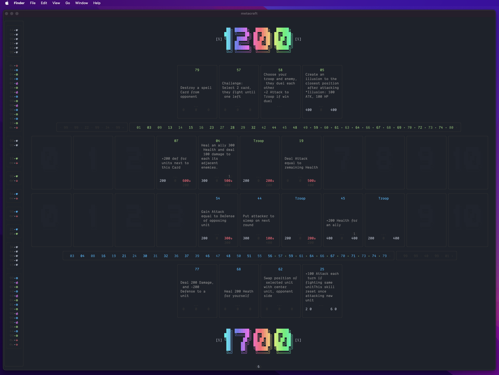

# Under Realm

Free-to-play Strategy Trading Card game

Under Realm: Rise of Magic takes place in the chaotic, fragmented world of ATEM, where humans and other races are constantly fighting each other, to quench the endless thirst for power, and wealth, and gradually take control over ATEM.

## Installation

Install all dependencies

```
yarn install
```

Install Metacraft CLI

```
npm install -g @metacraft/cli@latest
```

## Game

- Install [Cocos Dashboard](https://www.cocos.com/en/creator)
- Install Cocos Creator version `3.8.3` or newer
- Install deps for Game by `yarn install` under `game` folder
- Open `game` folder with Cocos creator
- Configure network endpoint under `./game/assets/scripts/network/util.ts` (line 6), either use remove endpoint or local endpoint at [Card Engine](https://github.com/cocrafts/engines)

### Build game

- Build game to `launcher/assets/murg`, we are currently using `web-mobile` build option

## Launcher

Prepare `.env` file follow the `.env.example`

Run launcher

```
cd launcher && yarn dev
```

### Deploy launcher

In `launcher` directory

- Prepare game build as the previous `game` section
- Prepare .env file with format `.env.{stage}`, See `.env.example`
- Deploy using `sst`, running

```
yarn deploy launcher --stage <production | development>
```

## API

- `.env` file at `api` dir, follow `api/.env.example`
- `jwk.json` at `api` dir to load by `jsonwebtoken`

Run the API

```
yarn dev
```

To add new query/mutation, you need to define it in `api/schema.graphql`. And run codegen to generate resolver types, object types, the implement the resolver.

_Note: codegen will run by fetching introspection from API endpoint, remember to run the API first_

```
# at root
yarn codegen:graphql
```

## Core engine


